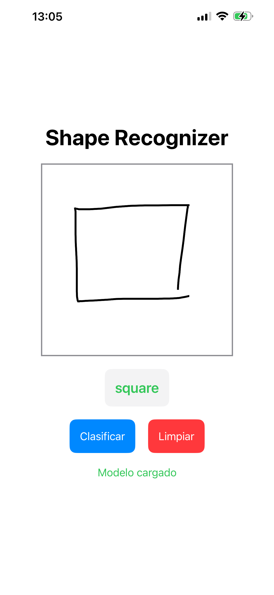
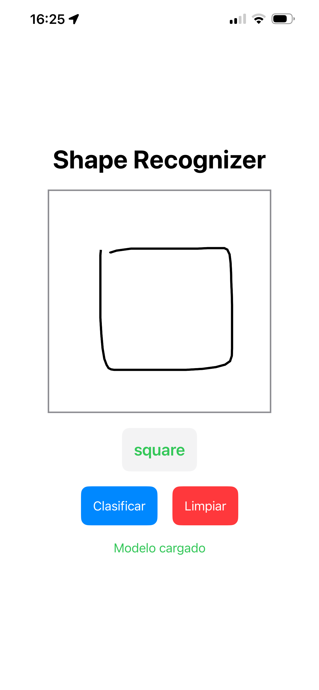
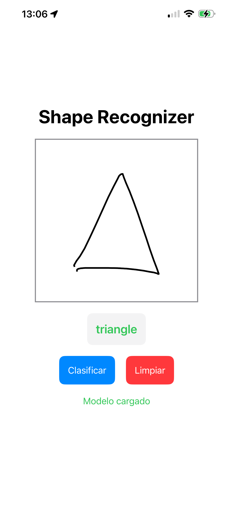
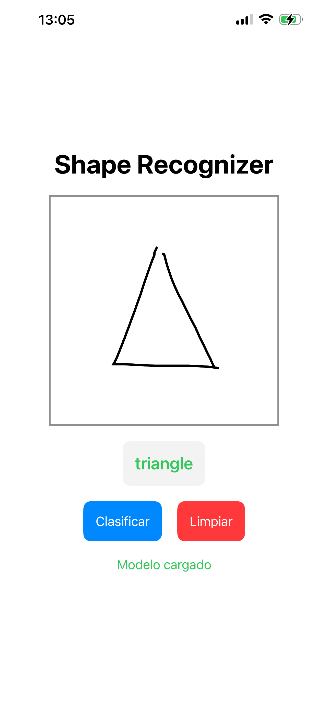
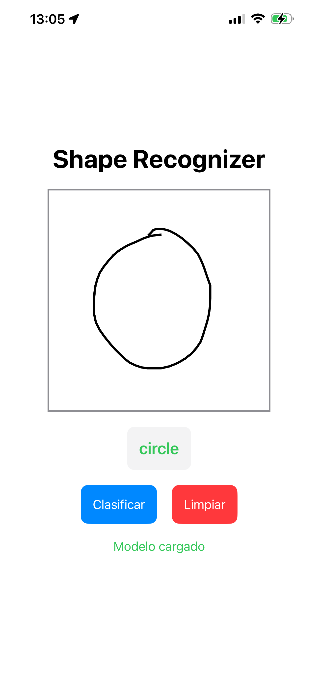
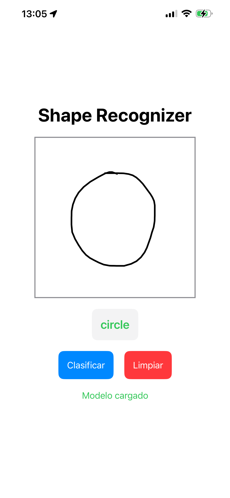

# PracticaVision_3


Este proyecto implementa un sistema de reconocimiento de formas geométricas (Círculos, Cuadrados, Triángulos) dividido en dos fases: procesamiento y generación de modelo en Python, e implementación de una aplicación iOS que utiliza OpenCV para la clasificación en tiempo real.

## Estructura del Proyecto

El repositorio se organiza en dos carpetas principales:

- **`Fase1_Procesamiento/`**: Entorno de investigación y desarrollo. Contiene notebooks de Jupyter para el preprocesamiento de imágenes, extracción de características y generación del archivo de entrenamiento.
- **`Fase2_iOS_App/`**: Aplicación nativa de iOS desarrollada en SwiftUI que integra C++ y OpenCV para consumir el modelo generado y clasificar formas.

## Dataset Utilizado

Para el entrenamiento y validación de los modelos se utilizó el [UPS Writing Skills Dataset](https://www.kaggle.com/datasets/adolfogavilanes/ups-writing-skills/data), disponible públicamente en Kaggle.
Este dataset contiene muestras de formas geométricas (círculos, cuadrados y triángulos) dibujadas a mano, capturadas para el análisis de habilidades de motricidad fina en niños.

---

## Requisitos Previos

### General
- Git para el control de versiones.

### Fase 1 (Python)
- Python 3.8+
- Jupyter Notebook o Lab
- Librerías necesarias (ver `requirements.txt` en Fase 1):
  - OpenCV (`opencv-python`)
  - NumPy
  - Matplotlib
  - Scikit-learn (si aplica)

### Fase 2 (iOS)
- **macOS**: Sistema operativo necesario para ejecutar Xcode.
- **Xcode**: IDE de desarrollo de Apple (versión 14+ recomendada).
- **Cuenta de Desarrollador de Apple**: (Puede ser una cuenta personal gratuita) Para firmar la aplicación y ejecutarla en un dispositivo físico.
- **OpenCV Framework**: El proyecto requiere el framework `opencv2.framework` para iOS.

---

## Instrucciones de Instalación y Ejecución

### Fase 1: Generación del Modelo

1. Navega a la carpeta de procesamiento:
   ```bash
   cd Fase1_Procesamiento
   ```
2. Instala las dependencias (se recomienda usar un entorno virtual):
   ```bash
   pip install -r requirements.txt
   ```
3. Ejecuta el notebook `Practica3.1-3.2.ipynb`.
   - Este script procesará el dataset de imágenes (`dataset/all-images/`), normalizará los datos y extraerá las caracteristicas necesarias.
   - **Salida**: Generará un archivo `ios_training_data_corrected.json`.
4. Si has generado un nuevo json, cópialo a la carpeta de la fase 2 para actualizar el modelo de la app.

### Fase 2: Aplicación iOS

#### 1. Configuración de OpenCV
Dado que `opencv2.framework` es muy pesado, no se incluye en el repositorio.
- Descarga el **iOS Pack** oficial de OpenCV (versión 4.x recomendada) desde [opencv.org/releases](https://opencv.org/releases/).
- Descomprime el archivo y arrastra `opencv2.framework` a la carpeta `Fase2_iOS_App/ShapeRecognizer/`.

#### 2. Abrir el Proyecto
1. Navega a `Fase2_iOS_App/ShapeRecognizer/`.
2. Abre el archivo `ShapeRecognizer.xcodeproj` con Xcode.

#### 3. Configuración de Firma (Signing)
Para ejecutar la app en tu dispositivo, necesitas configurar tu equipo de desarrollo:
1. En Xcode, selecciona el proyecto **ShapeRecognizer** en el navegador de archivos (barra lateral izquierda).
2. Selecciona el **Target** "ShapeRecognizer".
3. Ve a la pestaña **Signing & Capabilities**.
4. En la sección **Team**, selecciona tu cuenta personal.
5. Asegúrate de que el **Bundle Identifier** sea único (ej: `com.tu-nombre.ShapeRecognizer`) si tienes conflictos.

#### 4. Ejecución
- Conecta tu iPhone/iPad a la Mac.
- Selecciónalo como dispositivo de destino en la barra superior de Xcode.
- Presiona **Run** (Cmd + R).
- **Nota**: La primera vez que instales la app, deberás confiar en tu perfil de desarrollador desde *Ajustes > General > VPN y gestión de dispositivos* en tu iPhone.

---

## Flujo de Trabajo

1. **Entrenamiento**: Se realiza en la Fase 1 procesando las imágenes y ajustando parámetros.
2. **Exportación**: El resultado se guarda en `ios_training_data_corrected.json`.
3. **Inferencia**: La app iOS carga este JSON al iniciarse (`OpenCVWrapper.loadTrainingData`) y lo utiliza para clasificar nuevas imágenes capturadas o seleccionadas.

### Notas Adicionales
- Asegúrate de que las imágenes de entrenamiento en Fase 1 estén correctamente organizadas en sus carpetas respectivas (`circle`, `square`, `triangle`).
- El archivo `.gitignore` está configurado para evitar subir archivos temporales, binarios de compilación y el framework de OpenCV.

## Resultados de Experimentación (Fase 1)

El siguiente cuadro resume la precisión (accuracy) obtenida por los diferentes métodos de extracción de características evaluados en el cuaderno de Jupyter, probados bajo distintas condiciones de ruido y rotación.

| Método / Condición | Original | Ruido Gaussiano | Ruido S&P | Rotación (Giro) |
| :--- | :---: | :---: | :---: | :---: |
| **Momentos de Hu** | 43.06% | 27.78% | 38.89% | 36.11% |
| **Momentos de Zernike** | **94.44%** | **93.06%** | **91.67%** | **88.89%** |
| **Shape Signature (App)** | 81.94% | 40.28% | 62.50% | 59.72% |

> **Nota:** Aunque los Momentos de Zernike obtuvieron el mejor rendimiento general, para la implementación móvil se optó por una variación de **Shape Signature** debido a su eficiencia computacional y facilidad de implementación en C++ con OpenCV.

## Informe del Proyecto

Puedes consultar el informe completo en formato PDF con todos los detalles teóricos y experimentales aquí:
[📄 Ver Informe Completo (PDF)](Informe.pdf)

## Capturas de Pantalla

A continuación se muestran ejemplos de la aplicación clasificando correctamente las diferentes formas geométricas:

| Clasificación (Clase) | Ejemplo 1 | Ejemplo 2 |
|:---:|:---:|:---:|
| **Cuadrado** |  |  |
| **Triángulo** |  |  |
| **Círculo** |  |  |
